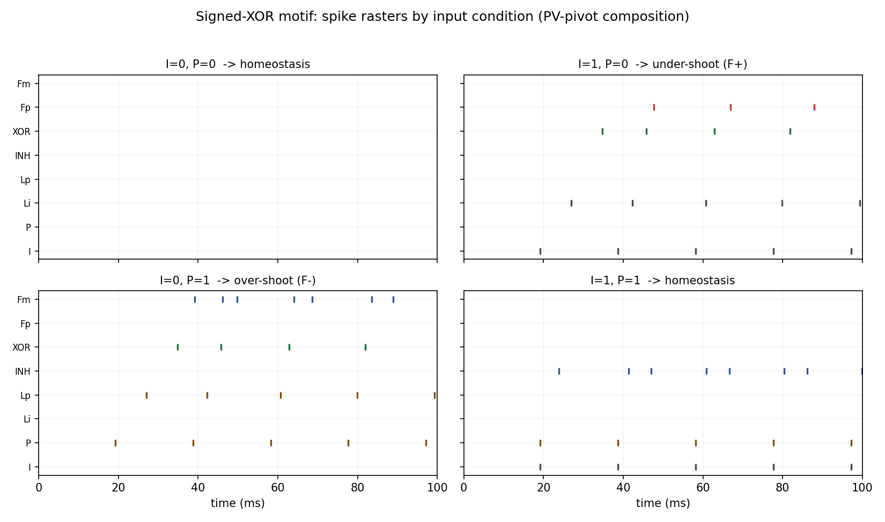

# Functional validation of the signed-XOR neuronal motif

A minimal, compiler-free **spiking** model of the 8-neuron *signed-XOR* motif,
built from mouse-cortex (Allen Institute V1) cell types. It complements the
structural graph analysis in the preprint *"A dynamical systems framework for
signed XOR learning in biological circuits"* (in preparation) by answering a question the paper
explicitly leaves open:

> *Does the motif actually compute the signed error when implemented with
> biologically plausible spiking neurons — and what does the fast-spiking
> phenotype of PV interneurons contribute?*

The preprint counts the motif on the static Allen V1 graph but states that it
"does not model neuron firing rates, spike timing, or other dynamical
properties" and that "a full functional characterisation requires spiking
simulation with realistic rates, which is out of scope for this paper." This
repository provides exactly that characterisation for the isolated motif.

## What it shows (headline results)

1. **The motif computes the full signed-XOR truth table** with leaky
   integrate-and-fire neurons. F⁺ fires only on under-shoot (target on,
   prediction off → LTP), F⁻ fires only on over-shoot (target off, prediction
   on → LTD), and matched inputs produce **no error signal** (homeostasis).
   Correct on all 4 conditions deterministically; **88%** full-table success
   under 20 Hz background Poisson noise across 25 seeds.

2. **Fast-spiking inhibition is *required*.** Sweeping the inhibitory membrane
   time constant shows the motif works in the fast-spiking PV regime
   (**100%** correct at τ = 6–7 ms) and **fails completely (0%) at
   pyramidal speed (τ ≥ 9 ms)**. Correspondingly, the empirical PV-pivot
   composition (`INH = i4Pvalb`) works while the Sst-pivot rank-1 composition
   (`INH = i4Sst`, not fast-spiking) does not. This turns the preprint's
   *caveat* about PV speed into a concrete, falsifiable **prediction**:
   functional signed-XOR pivots should be fast-spiking (PV), not Sst.

3. **The signed error is graded.** Holding the target ON and sweeping the
   prediction drive yields F⁺ on the under-shoot side, a zero-crossing at the
   match point (~0.9× target), and F⁻ on the over-shoot side — realising the
   graded form F⁺ = max(0, x−r), F⁻ = max(0, r−x).

| input (S1, S2) | meaning | XOR | F⁺ | F⁻ |
|:---:|:---|:---:|:---:|:---:|
| (0, 0) | homeostasis (no error) | 0 | 0 | 0 |
| (1, 0) | under-shoot → LTP | 1 | **1** | 0 |
| (0, 1) | over-shoot → LTD | 1 | 0 | **1** |
| (1, 1) | homeostasis (matched) | 0 | 0 | 0 |



## The circuit

Eight LIF neurons mapped onto the motif's 8 roles, wired with the same 12 edges
counted on the Allen V1 graph:

```
   E1 (S1, input) ─►┐         ┌─► E2 ─►┐         ┌─► F+  (excitatory, LTP)
                    ├─► INH ─┤(veto)   ├─► XOR ─┤
   E3 (S2, predn) ─►┘  (PV)   └─► E4 ─►┘         └─► F-  (inhibitory, LTD)
```

- **INH** is a *coincidence detector*: a single active input is sub-threshold;
  only both inputs together make it fire. When it fires it vetoes both latents.
- Hence E2 active ⇔ (E1 ∧ ¬E3), E4 active ⇔ (E3 ∧ ¬E1), so **XOR = E1 ⊕ E3**.
- **F⁺** = coincidence(E2, XOR) → fires only on under-shoot.
  **F⁻** = coincidence(E4, XOR) → fires only on over-shoot.

The veto and the coincidence detection both depend on inhibition being *fast*,
which is why the PV phenotype matters (result 2 above).

### Cell-type mapping (Allen V1, mouse)

| role | cell type | phenotype |
|:---|:---|:---|
| E1, E3 (inputs) | `e4other` | L4 excitatory, regular-spiking |
| E2, E4 (latents) | `e23Cux2` | L2/3 excitatory, regular-spiking |
| INH (pivot) | `i4Pvalb` | L4 **PV fast-spiking** |
| XOR (comparator) | `e23Cux2` | L2/3 excitatory |
| F⁺ (positive error) | `e23Cux2` | L2/3 excitatory |
| F⁻ (negative error) | `i23Pvalb` | L2/3 **PV fast-spiking** |

## Install & run

Tested on Python 3.10–3.12, Linux / **WSL (Ubuntu on Windows 11)** and DGX.
The default Brian2 backend is the `numpy` code generator, which **needs no C/C++
compiler** — nothing to install beyond the Python packages, which is what makes
it run cleanly under WSL out of the box.

```bash
# from a WSL terminal (or any Linux/macOS shell)
python -m venv .venv && source .venv/bin/activate
pip install -r requirements.txt

# run everything (≈1–2 min on a laptop CPU; the motif is only 8 neurons)
python experiments/run_all.py

# or one experiment at a time
python experiments/exp1_truth_table.py
python experiments/exp2_pv_robustness.py
python experiments/exp3_graded_error.py

# run the tests
pytest -q
```

Figures, CSVs and JSON summaries are written to `results/`.

### On a DGX (optional)

This task is tiny (8 neurons), so a GPU/DGX is not needed. If you want the
compiled Brian2 backend for speed in larger follow-ups, set
`brian2.prefs.codegen.target = "cython"` (requires a working `gcc`); the `numpy`
default already used here is portable and sufficient at this scale.

## Repository layout

```
signed_xor/            core library
  celltypes.py         Allen V1 cell-type LIF parameters + named compositions
  motif.py             builds & simulates the 8-neuron motif (Brian2)
  readout.py           decode spikes -> signed-XOR truth table
  plotting.py          rasters, heatmap, sweep, graded-error figures
experiments/           reproducible experiment scripts (exp1-3 + run_all)
tests/                 pytest assertions on the truth table + PV requirement
results/               generated figures, CSVs, JSON summaries
paper/                 drop-in LaTeX subsection for the preprint
```

## Reproducibility & honest limits

- All results are produced by the scripts in `experiments/`; the figures and
  CSVs in `results/` are regenerable with `python experiments/run_all.py`.
- This validates the **isolated motif**, not the full V1 reservoir. It does not
  model dendritic dynamics, conductance-based synapses, short-term plasticity,
  or STDP learning — it tests the *inference-time* signed-error logic only.
- The synaptic weights are tuned to place INH in the coincidence regime and the
  F-neurons in the coincidence regime; the *qualitative* conclusions (truth
  table; fast-spiking requirement; graded error) are what matter, and the
  fast-spiking sweep (`exp2`) quantifies how robust they are to the one
  biologically critical parameter.

## Citation

See `CITATION.cff`. Please cite the associated preprint and this software.

## License

CC-by-NC 4.0 — see `LICENSE`.
